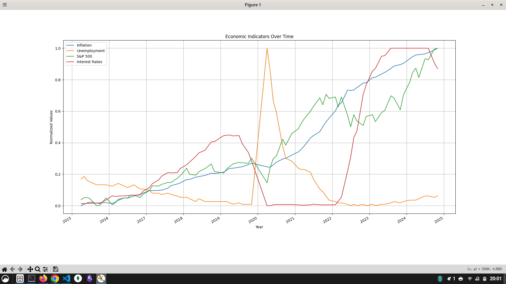
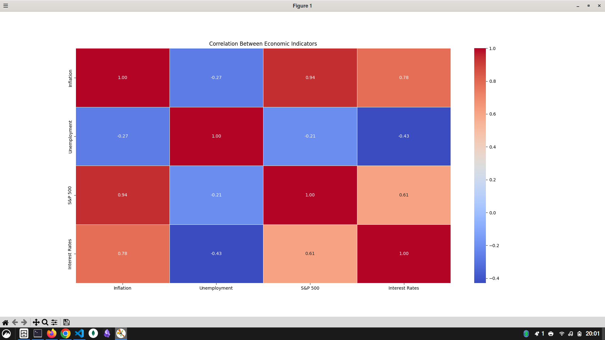

# Economic Data Analysis with FRED API

This project analyzes key economic indicators using data from the **FRED API** and explores their correlation with **S&P 500 performance**. We visualize trends with **time-series plots and heatmaps**, and conduct **regression analysis** to examine relationships between variables.

## Features
- Fetch **economic data** from FRED API
- Time-series visualization of economic indicators
- **Correlation heatmap** to explore relationships between variables
- **Regression analysis** to predict S&P 500 performance
- **Granger causality tests** to assess lead-lag relationships

## Economic Data Used
We retrieve the following economic indicators from **FRED API**:

| Indicator        | FRED Series ID | Description |
|----------------|--------------|-------------|
| **Inflation** | `CPIAUCSL` | Consumer Price Index (CPI), a proxy for inflation |
| **Unemployment Rate** | `UNRATE` | U.S. Unemployment Rate (%) |
| **S&P 500 Index** | `SP500` | S&P 500 stock market index |
| **Interest Rates** | `FEDFUNDS` | Federal Funds Rate |

## Setup & Installation
### 1️. Clone the Repository
```bash
git clone https://github.com/J11tendra/Econ-Data-Analysis
cd Econ-Data-Analysis
```
### 2️. Install Required Packages
Make sure you have **Python 3.x** installed. Then, install dependencies:
```bash
pip install numpy pandas matplotlib seaborn statsmodels fredapi
```
### 3️. Set Up Your FRED API Key
Get an API key from [FRED API](https://fred.stlouisfed.org/) and store it in an environment variable:
```bash
export FRED_API_KEY='your_api_key_here'
```
Alternatively, modify the script to directly assign the key:
```python
fred_key = 'your_api_key_here'
```

### 4️. Run the Script
Execute the script to fetch data, visualize trends, and run statistical analyses:
```bash
python data.py
```

## Visualization Results
### **1. Economic Indicators Over Time**
The following chart normalizes and plots the economic indicators over time for better visualization:



### **2. Correlation Heatmap**
This heatmap shows the correlation between different economic indicators:



### **3. Regression Analysis Summary**
We use **Ordinary Least Squares (OLS) regression** to analyze how inflation, unemployment, and interest rates impact the **S&P 500 Index**.

```
                            OLS Regression Results                            
==============================================================================
Dep. Variable:               S&P 500   R-squared:    0.XX
Model:                            OLS   Adj. R-squared:    0.XX
Method:                 Least Squares   F-statistic:   XX.XX
...
```

## Analysis & Insights
1. **Time-Series Trends:**
   - Inflation and interest rates often move together.
   - S&P 500 shows an inverse relationship with unemployment.

2. **Heatmap Observations:**
   - Higher inflation correlates with higher interest rates.
   - S&P 500 negatively correlates with interest rates and unemployment.

3. **Regression Findings:**
   - Inflation and interest rates significantly impact the S&P 500.
   - The model suggests a negative relationship between interest rates and stock market performance.

4. **Granger Causality Results:**
   - We test if **inflation** or **interest rates** **Granger-cause** the S&P 500 index.
   - Results suggest that **interest rates have a stronger predictive power** over stock market movements.

## Limitations of the Analysis
- **Limited Variables:** The analysis does not include all possible factors affecting the S&P 500, such as corporate earnings, geopolitical events, and monetary policies.
- **Linear Assumptions:** The regression model assumes a linear relationship between variables, which may not always hold in economic data.
- **Data Stationarity:** Time-series data often exhibit trends and seasonality, which may impact the accuracy of statistical tests like Granger causality.

## License
This project is open-source under the MIT License.